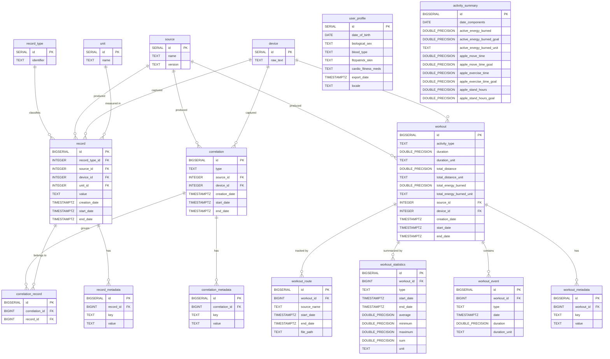

# Pulso — Apple Health XML to PostgreSQL ETL

## Context

We have a 1.5GB Apple Health XML export (`exportar.xml`) containing 3.4M+ health records, 1,819 workouts, activity summaries, and more — spanning ~4.5 years of data. The goal is to build a Clojure ETL engine that streams this XML and loads it into a normalized PostgreSQL relational model.

**Tech stack:** Clojure, Leiningen, Migratus, PostgreSQL, Docker, next.jdbc, clojure.data.xml

**Scope (v1):** Main XML only (no GPX routes or ECG CSVs)

---

## 1. Project Structure

```
pulso/
├── project.clj
├── .gitignore
├── Dockerfile
├── docker-compose.yml
├── .dockerignore
├── resources/
│   └── migrations/
│       ├── 20260214160000-create-lookup-tables.up.sql
│       ├── 20260214160000-create-lookup-tables.down.sql
│       ├── 20260214160100-create-user-profile.up.sql
│       ├── 20260214160100-create-user-profile.down.sql
│       ├── 20260214160200-create-record-tables.up.sql
│       ├── 20260214160200-create-record-tables.down.sql
│       ├── 20260214160300-create-workout-tables.up.sql
│       ├── 20260214160300-create-workout-tables.down.sql
│       ├── 20260214160400-create-correlation-tables.up.sql
│       ├── 20260214160400-create-correlation-tables.down.sql
│       ├── 20260214160500-create-activity-summary.up.sql
│       └── 20260214160500-create-activity-summary.down.sql
├── src/
│   └── pulso/
│       ├── core.clj              ;; CLI entry point
│       ├── config.clj            ;; DB + app config
│       ├── db.clj                ;; Datasource, migrations, truncate
│       ├── xml/
│       │   ├── parser.clj        ;; Streaming XML parser with element dispatch
│       │   └── transform.clj     ;; XML elements → Clojure maps
│       ├── loader/
│       │   ├── batch.clj         ;; Generic batch insert machinery
│       │   ├── lookups.clj       ;; Lookup table cache & upsert
│       │   ├── records.clj       ;; Record + metadata loading
│       │   ├── workouts.clj      ;; Workout + events + stats + routes
│       │   ├── correlations.clj  ;; Correlation + nested records
│       │   ├── activity.clj      ;; ActivitySummary loading
│       │   └── profile.clj       ;; User profile (Me element)
│       └── etl.clj               ;; Orchestrator: parse → transform → load
└── test/
    └── pulso/
        ├── xml/
        │   ├── parser_test.clj
        │   └── transform_test.clj
        └── loader/
            └── batch_test.clj
```

---

## 2. Dependencies (project.clj)

```clojure
(defproject pulso "0.1.0-SNAPSHOT"
  :description "Apple Health XML data ETL into PostgreSQL"
  :license {:name "MIT"}
  :min-lein-version "2.0.0"
  :dependencies [[org.clojure/clojure "1.12.0"]
                 [org.clojure/data.xml "0.2.0-alpha9"]   ;; StAX streaming XML
                 [org.clojure/tools.cli "1.1.230"]       ;; CLI arg parsing
                 [org.clojure/tools.logging "1.3.0"]
                 [com.github.seancorfield/next.jdbc "1.3.939"]
                 [org.postgresql/postgresql "42.7.4"]
                 [com.zaxxer/HikariCP "6.2.1"]
                 [migratus "1.5.8"]
                 [ch.qos.logback/logback-classic "1.5.12"]]
  :main pulso.core
  :aot [pulso.core]
  :plugins [[migratus-lein "0.7.3"]]
  :migratus {:store :database
             :migration-dir "migrations"
             :db {:dbtype "postgresql"
                  :dbname "pulso"
                  :host "localhost"
                  :port 5432
                  :user "postgres"
                  :password "postgres"}}
  :jvm-opts ["-Xmx512m" "-XX:+UseG1GC"]
  :profiles {:uberjar {:aot :all
                        :jvm-opts ["-Dclojure.compiler.direct-linking=true"]}})
```

---

## 3. Database Relational Model

### Entity Relationship Diagram



### Schema Details (DDL)

### 3a. Lookup / Dimension Tables

```sql
CREATE TABLE source (
    id       SERIAL PRIMARY KEY,
    name     TEXT NOT NULL,
    version  TEXT,
    UNIQUE (name, version)
);

CREATE TABLE device (
    id       SERIAL PRIMARY KEY,
    raw_text TEXT NOT NULL UNIQUE   -- Store <<HKDevice: ...>> as-is for v1
);

CREATE TABLE record_type (
    id         SERIAL PRIMARY KEY,
    identifier TEXT NOT NULL UNIQUE  -- e.g. "HKQuantityTypeIdentifierHeartRate"
);

CREATE TABLE unit (
    id   SERIAL PRIMARY KEY,
    name TEXT NOT NULL UNIQUE        -- e.g. "count/min", "kcal"
);
```

### 3b. User Profile

```sql
CREATE TABLE user_profile (
    id                  SERIAL PRIMARY KEY,
    date_of_birth       DATE,
    biological_sex      TEXT,
    blood_type          TEXT,
    fitzpatrick_skin    TEXT,
    cardio_fitness_meds TEXT,
    export_date         TIMESTAMPTZ,
    locale              TEXT
);
```

### 3c. Record Tables (3.4M+ rows)

```sql
CREATE TABLE record (
    id             BIGSERIAL PRIMARY KEY,
    record_type_id INTEGER NOT NULL REFERENCES record_type(id),
    source_id      INTEGER REFERENCES source(id),
    device_id      INTEGER REFERENCES device(id),
    unit_id        INTEGER REFERENCES unit(id),
    value          TEXT,             -- TEXT: some values are categorical (e.g. SleepAnalysis)
    creation_date  TIMESTAMPTZ,
    start_date     TIMESTAMPTZ NOT NULL,
    end_date       TIMESTAMPTZ NOT NULL
);

CREATE INDEX idx_record_type      ON record (record_type_id);
CREATE INDEX idx_record_start     ON record (start_date);
CREATE INDEX idx_record_type_date ON record (record_type_id, start_date);

CREATE TABLE record_metadata (
    id        BIGSERIAL PRIMARY KEY,
    record_id BIGINT NOT NULL REFERENCES record(id) ON DELETE CASCADE,
    key       TEXT NOT NULL,
    value     TEXT
);

CREATE INDEX idx_record_metadata_record ON record_metadata (record_id);
```

### 3d. Workout Tables

```sql
CREATE TABLE workout (
    id                       BIGSERIAL PRIMARY KEY,
    activity_type            TEXT NOT NULL,
    duration                 DOUBLE PRECISION,
    duration_unit            TEXT,
    total_distance           DOUBLE PRECISION,
    total_distance_unit      TEXT,
    total_energy_burned      DOUBLE PRECISION,
    total_energy_burned_unit TEXT,
    source_id                INTEGER REFERENCES source(id),
    device_id                INTEGER REFERENCES device(id),
    creation_date            TIMESTAMPTZ,
    start_date               TIMESTAMPTZ NOT NULL,
    end_date                 TIMESTAMPTZ NOT NULL
);

CREATE INDEX idx_workout_type  ON workout (activity_type);
CREATE INDEX idx_workout_start ON workout (start_date);

CREATE TABLE workout_metadata (
    id         BIGSERIAL PRIMARY KEY,
    workout_id BIGINT NOT NULL REFERENCES workout(id) ON DELETE CASCADE,
    key        TEXT NOT NULL,
    value      TEXT
);

CREATE TABLE workout_event (
    id            BIGSERIAL PRIMARY KEY,
    workout_id    BIGINT NOT NULL REFERENCES workout(id) ON DELETE CASCADE,
    type          TEXT NOT NULL,
    date          TIMESTAMPTZ,
    duration      DOUBLE PRECISION,
    duration_unit TEXT
);

CREATE TABLE workout_statistics (
    id         BIGSERIAL PRIMARY KEY,
    workout_id BIGINT NOT NULL REFERENCES workout(id) ON DELETE CASCADE,
    type       TEXT NOT NULL,
    start_date TIMESTAMPTZ,
    end_date   TIMESTAMPTZ,
    average    DOUBLE PRECISION,
    minimum    DOUBLE PRECISION,
    maximum    DOUBLE PRECISION,
    sum        DOUBLE PRECISION,
    unit       TEXT
);

CREATE TABLE workout_route (
    id          BIGSERIAL PRIMARY KEY,
    workout_id  BIGINT NOT NULL REFERENCES workout(id) ON DELETE CASCADE,
    source_name TEXT,
    start_date  TIMESTAMPTZ,
    end_date    TIMESTAMPTZ,
    file_path   TEXT
);
```

### 3e. Correlation Tables

```sql
CREATE TABLE correlation (
    id            BIGSERIAL PRIMARY KEY,
    type          TEXT NOT NULL,
    source_id     INTEGER REFERENCES source(id),
    device_id     INTEGER REFERENCES device(id),
    creation_date TIMESTAMPTZ,
    start_date    TIMESTAMPTZ NOT NULL,
    end_date      TIMESTAMPTZ NOT NULL
);

CREATE TABLE correlation_metadata (
    id             BIGSERIAL PRIMARY KEY,
    correlation_id BIGINT NOT NULL REFERENCES correlation(id) ON DELETE CASCADE,
    key            TEXT NOT NULL,
    value          TEXT
);

CREATE TABLE correlation_record (
    id             BIGSERIAL PRIMARY KEY,
    correlation_id BIGINT NOT NULL REFERENCES correlation(id) ON DELETE CASCADE,
    record_id      BIGINT NOT NULL REFERENCES record(id) ON DELETE CASCADE
);
```

### 3f. Activity Summary

```sql
CREATE TABLE activity_summary (
    id                        BIGSERIAL PRIMARY KEY,
    date_components           DATE NOT NULL UNIQUE,
    active_energy_burned      DOUBLE PRECISION,
    active_energy_burned_goal DOUBLE PRECISION,
    active_energy_burned_unit TEXT,
    apple_move_time           DOUBLE PRECISION,
    apple_move_time_goal      DOUBLE PRECISION,
    apple_exercise_time       DOUBLE PRECISION,
    apple_exercise_time_goal  DOUBLE PRECISION,
    apple_stand_hours         DOUBLE PRECISION,
    apple_stand_hours_goal    DOUBLE PRECISION
);
```

---

## 4. Docker Setup

### docker-compose.yml

Two services: PostgreSQL database and the Pulso ETL app.

```yaml
services:
  db:
    image: postgres:17-alpine
    environment:
      POSTGRES_DB: pulso
      POSTGRES_USER: postgres
      POSTGRES_PASSWORD: postgres
    ports:
      - "5432:5432"
    volumes:
      - pgdata:/var/lib/postgresql/data
    healthcheck:
      test: ["CMD-LINE", "pg_isready -U postgres"]
      interval: 5s
      timeout: 3s
      retries: 5

  app:
    build: .
    depends_on:
      db:
        condition: service_healthy
    environment:
      DB_HOST: db
      DB_PORT: 5432
      DB_NAME: pulso
      DB_USER: postgres
      DB_PASSWORD: postgres
    volumes:
      - ./data:/data    # Mount directory containing exportar.xml
    command: ["--file", "/data/exportar.xml"]

volumes:
  pgdata:
```

### Dockerfile

Multi-stage build: first stage compiles the uberjar, second stage runs it on a slim JRE.

```dockerfile
FROM clojure:lein-2.11.2-jammy AS builder
WORKDIR /app
COPY project.clj .
RUN lein deps
COPY . .
RUN lein uberjar

FROM eclipse-temurin:21-jre-alpine
WORKDIR /app
COPY --from=builder /app/target/uberjar/pulso-*-standalone.jar app.jar
ENTRYPOINT ["java", "-Xmx512m", "-jar", "app.jar"]
```

### .gitignore

Health data is sensitive and must never be committed to version control.

```gitignore
# User health data (SENSITIVE — never commit)
data/
*.xml
*.zip
*.gpx
*.csv

# Clojure / Leiningen
target/
classes/
.lein-*
.nrepl-port

# IDE
.idea/
*.iml
.vscode/
.calva/

# OS
.DS_Store
```

### .dockerignore

```
target/
.git/
data/
*.zip
```

### Usage

```bash
# Place exportar.xml in ./data/
mkdir -p data && cp /path/to/exportar.xml data/

# Start PostgreSQL + run ETL
docker compose up --build

# Or just PostgreSQL (for local dev with lein run)
docker compose up db
```

---

## 5. ETL Pipeline Architecture

**Single-pass streaming with dispatch on element tag:**

```
              1.5GB XML File
                   │
        clojure.data.xml/parse (StAX, lazy)
                   │
        Iterate root children (doseq — no head retention)
                   │
      ┌────────┬───┴───┬───────────┬──────────────┐
     <Me>  <Record>  <Workout>  <Correlation>  <ActivitySummary>
      │       │         │           │               │
  transform  transform  transform  transform    transform
      │       │         │           │               │
   INSERT   BATCH     INSERT+     INSERT+        BATCH
    (1)    (5000)     children    children       (1000)
```

**Key design decisions:**
- **Streaming:** `clojure.data.xml/parse` uses StAX. Children of root are lazy, each individual element is small → safe memory profile with `-Xmx512m`
- **Lookup caching:** Source, device, record_type, unit cached in atoms (only ~50-100 unique values total). Cache miss → `INSERT ON CONFLICT ... RETURNING id`
- **Batch inserts:** Records accumulated in buffer (atom), flushed via `next.jdbc execute-batch!` every 5000 rows. Metadata flushed after parent records (needs returned IDs)
- **Idempotency:** `TRUNCATE ... CASCADE` all tables before each run (v1 strategy)
- **Date parsing:** Apple format `"2025-01-01 10:00:00 -0300"` → `java.time.OffsetDateTime` via custom `DateTimeFormatter`

---

## 6. Implementation Order

### Phase 1: Scaffolding
1. Create `project.clj` with all dependencies
2. Create directory structure and namespace stubs
3. Implement `pulso.config` — default DB settings
4. Implement `pulso.db` — datasource, migration runner, truncate
5. Write all 6 migration pairs (up/down SQL files)
6. **Verify:** `lein migratus migrate` runs successfully

### Phase 2: XML Parsing
7. Implement `pulso.xml.transform` — pure functions: XML element → Clojure map (with tests)
8. Implement `pulso.xml.parser` — streaming parse + dispatch

### Phase 3: Loaders (bottom-up)
9. Implement `pulso.loader.batch` — generic batch insert machinery
10. Implement `pulso.loader.lookups` — lookup table caching with upsert
11. Implement `pulso.loader.profile` — user profile insert (simplest)
12. Implement `pulso.loader.activity` — activity summary batch insert
13. Implement `pulso.loader.records` — record + metadata (core complexity)
14. Implement `pulso.loader.workouts` — workout + children
15. Implement `pulso.loader.correlations` — correlation + nested records

### Phase 4: Orchestration & CLI
16. Implement `pulso.etl` — wire parser to loaders, flush lifecycle, counters
17. Implement `pulso.core` — CLI with tools.cli, validation, `-main`
18. **Verify:** End-to-end test with small sample (~1000 elements)

### Phase 5: Full Load & Tuning
19. Run against full 1.5GB file
20. Tune batch sizes, add progress logging (every 100k records)
21. Verify row counts match expected totals
22. Build uberjar: `lein uberjar`

---

## 7. Verification

1. `lein migratus migrate` — schema created without errors
2. `lein run -- --file /path/to/small-sample.xml` — loads sample data
3. Query PostgreSQL to verify:
   - `SELECT count(*) FROM record` matches expected
   - `SELECT count(*) FROM workout` = 1,819
   - `SELECT * FROM user_profile` shows correct DOB and sex
   - `SELECT rt.identifier, count(*) FROM record r JOIN record_type rt ON r.record_type_id = rt.id GROUP BY rt.identifier ORDER BY count DESC` matches XML type counts
4. Full load: `lein run -- --file /path/to/exportar.xml` completes without OOM
5. `lein uberjar` builds successfully
